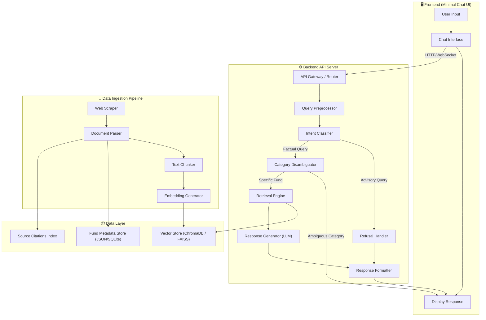
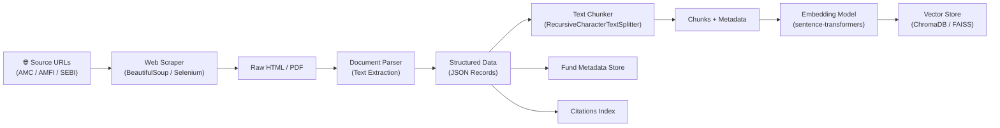
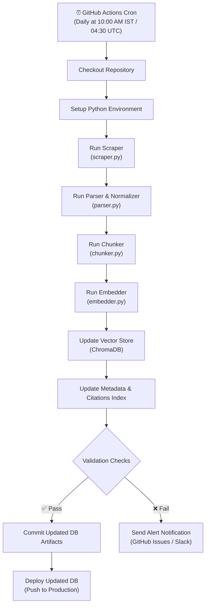
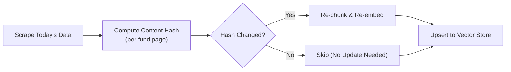
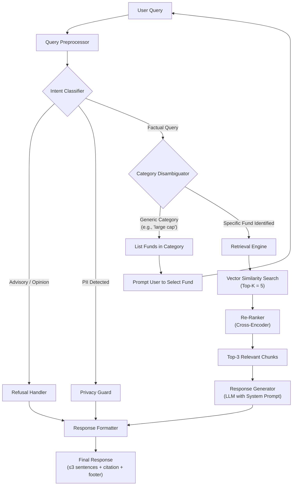
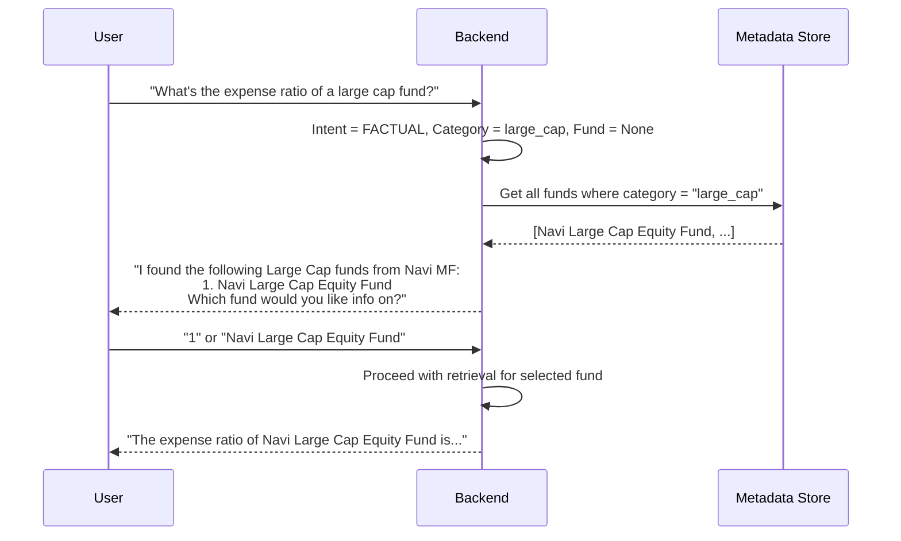
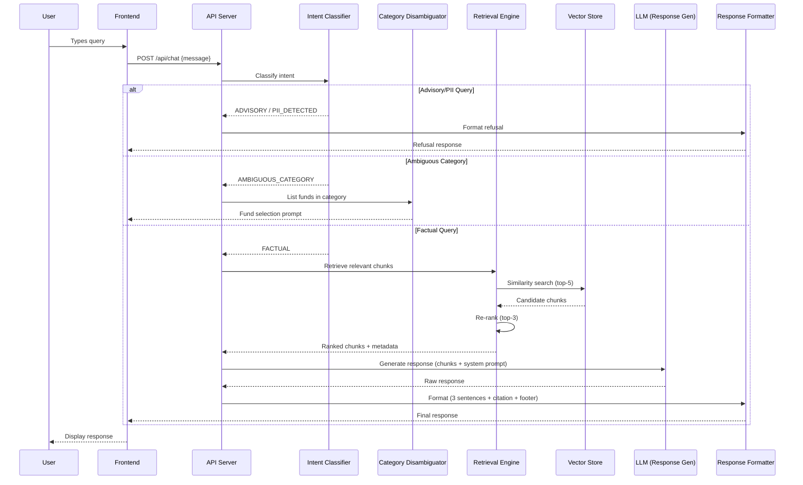
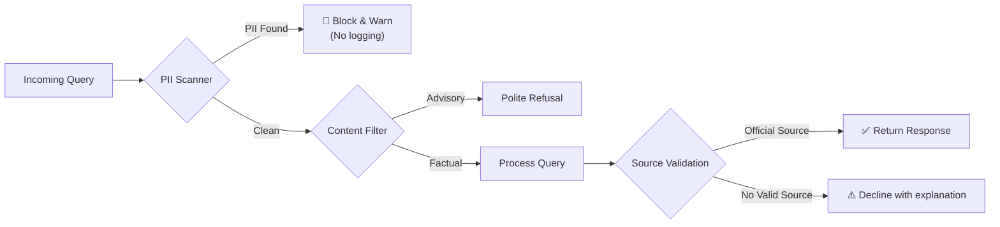
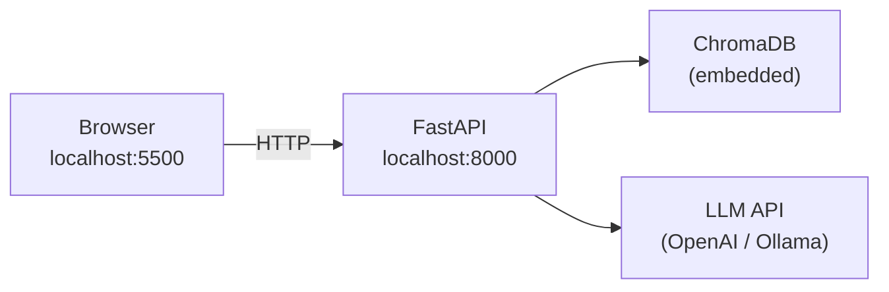
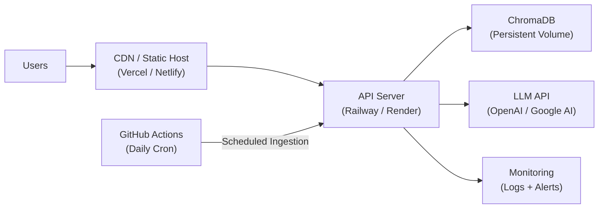

# Architecture: Mutual Fund FAQ Assistant

---

## 1. High-Level Architecture

The system follows a **Retrieval-Augmented Generation (RAG)** architecture, where user queries are processed through a multi-stage pipeline: intent classification, retrieval from a curated vector store, and constrained response generation via an LLM.



---

## 2. Component Architecture

### 2.1 Data Ingestion Pipeline

Responsible for scraping, parsing, chunking, and embedding mutual fund data from official sources into the vector store. This pipeline is **automated via a daily GitHub Actions scheduler** to ensure the corpus always reflects the latest fund data.



| Component | Technology | Purpose |
|---|---|---|
| **Web Scraper** | `BeautifulSoup` / `Selenium` | Scrape fund pages from [indmoney.com/mutual-funds/amc/navi-mutual-fund](https://www.indmoney.com/mutual-funds/amc/navi-mutual-fund) |
| **Document Parser** | `PyPDF2` / custom HTML parser | Extract structured text from HTML pages and PDF factsheets |
| **Text Chunker** | LangChain `RecursiveCharacterTextSplitter` | Split documents into semantically meaningful chunks (300–500 tokens) |
| **Embedding Model** | `sentence-transformers/all-MiniLM-L6-v2` | Generate dense vector embeddings for each chunk |
| **Vector Store** | `ChromaDB` (dev) / `FAISS` (prod) | Store and index embeddings for similarity search |
| **Metadata Store** | JSON file / SQLite | Store fund-level metadata (category, name, AMC, scheme code) |
| **Citations Index** | JSON file | Map each chunk to its original source URL and scrape date |

#### Chunk Metadata Schema

```json
{
  "chunk_id": "navi_largecap_001_chunk_03",
  "fund_name": "Navi Large Cap Equity Fund",
  "fund_category": "Large Cap",
  "scheme_code": "XXXXXX",
  "source_url": "https://www.indmoney.com/mutual-funds/navi-large-cap-equity-fund",
  "scrape_date": "2026-08-28",
  "section": "expense_ratio",
  "content": "The expense ratio of Navi Large Cap Equity Fund is 0.12% for the Direct Plan..."
}
```

#### 🔄 Daily Ingestion Scheduler (GitHub Actions)

The entire ingestion pipeline runs automatically every day via a **GitHub Actions cron workflow**, ensuring the vector store and metadata are always up-to-date.



##### Workflow File: `.github/workflows/daily-ingestion.yml`

```yaml
name: Daily Data Ingestion Pipeline

on:
  schedule:
    - cron: '30 4 * * *'   # Runs daily at 10:00 AM IST (04:30 UTC)
  workflow_dispatch:         # Allow manual trigger

jobs:
  ingest:
    runs-on: ubuntu-latest
    steps:
      - name: Checkout repository
        uses: actions/checkout@v4

      - name: Setup Python
        uses: actions/setup-python@v5
        with:
          python-version: '3.11'
          cache: 'pip'

      - name: Install dependencies
        run: pip install -r requirements.txt

      - name: Run scraper
        run: python ingestion/scraper.py
        env:
          SCRAPE_SOURCE: ${{ vars.SCRAPE_SOURCE_URL }}

      - name: Run parser & normalizer
        run: python ingestion/parser.py

      - name: Run chunker
        run: python ingestion/chunker.py

      - name: Run embedder & update vector store
        run: python ingestion/embedder.py
        env:
          EMBEDDING_MODEL: ${{ vars.EMBEDDING_MODEL }}

      - name: Validate ingestion
        run: python ingestion/validate.py

      - name: Commit updated data
        run: |
          git config user.name "github-actions[bot]"
          git config user.email "github-actions[bot]@users.noreply.github.com"
          git add data/ vectorstore/
          git diff --cached --quiet || git commit -m "chore: daily data ingestion $(date +%Y-%m-%d)"
          git push

      - name: Notify on failure
        if: failure()
        uses: actions/github-script@v7
        with:
          script: |
            github.rest.issues.create({
              owner: context.repo.owner,
              repo: context.repo.repo,
              title: `❌ Daily ingestion failed - ${new Date().toISOString().split('T')[0]}`,
              body: `The daily data ingestion pipeline failed. Check the [workflow run](${context.serverUrl}/${context.repo.owner}/${context.repo.repo}/actions/runs/${context.runId}).`,
              labels: ['bug', 'ingestion']
            });
```

##### Pipeline Stages Detail

| Stage | Script | What It Does |
|---|---|---|
| **1. Scraping** | `scraper.py` | Fetches latest HTML pages from source URLs (AMC/AMFI) |
| **2. Parsing & Normalization** | `parser.py` | Extracts structured text, normalizes fields (expense ratio, exit load, etc.) |
| **3. Chunking** | `chunker.py` | Splits normalized text into semantic chunks (300–500 tokens) with metadata |
| **4. Embedding** | `embedder.py` | Generates vector embeddings for all new/updated chunks |
| **5. DB Update** | `embedder.py` | Upserts embeddings into ChromaDB, removes stale entries |
| **6. Validation** | `validate.py` | Runs sanity checks — chunk count, embedding dimensions, zero-vector detection |

##### Update Strategy



> [!NOTE]
> The pipeline uses **content hashing** to detect changes — only pages with updated content are re-processed. This minimizes unnecessary embedding computation and keeps the pipeline efficient.

> [!IMPORTANT]
> The `scrape_date` field in chunk metadata is updated on every successful run, ensuring the `"Last updated from sources: <date>"` footer in responses always reflects the freshest data.

---

### 2.2 Query Processing Pipeline

The core runtime pipeline that processes each user query through classification, disambiguation, retrieval, and generation.



---

### 2.3 Intent Classification

The Intent Classifier categorizes every incoming query into one of four intents before any retrieval occurs.

| Intent | Description | Action |
|---|---|---|
| `FACTUAL` | Verifiable query about fund data | Proceed to retrieval |
| `ADVISORY` | Seeks investment advice or comparison | Trigger refusal handler |
| `AMBIGUOUS_CATEGORY` | Mentions category but no specific fund | Trigger disambiguation |
| `PII_DETECTED` | Contains sensitive personal information | Trigger privacy guard |

#### Classification Approach

```
Option A (Recommended): LLM-based zero-shot classification via system prompt
Option B (Lightweight):  Keyword + regex rules for known advisory/PII patterns
Option C (Hybrid):       Rule-based first pass → LLM fallback for edge cases
```

> [!TIP]
> The **hybrid approach (Option C)** is recommended — fast regex rules catch obvious advisory/PII patterns, with LLM fallback for nuanced cases. This balances latency and accuracy.

---

### 2.4 Category-Aware Disambiguation

When a user mentions a **fund category** (e.g., "large cap", "ELSS") without specifying a particular scheme, the disambiguator intercepts the query.

#### Fund Category Mapping

```json
{
  "large_cap": [
    {"name": "Navi Large Cap Equity Fund", "scheme_code": "..."},
  ],
  "mid_cap": [
    {"name": "Navi Midcap 150 Index Fund", "scheme_code": "..."},
  ],
  "small_cap": [
    {"name": "Navi Small Cap Equity Fund", "scheme_code": "..."},
  ],
  "elss": [
    {"name": "Navi ELSS Tax Saver Fund", "scheme_code": "..."},
  ],
  "flexi_cap": [
    {"name": "Navi Flexi Cap Fund", "scheme_code": "..."},
  ]
}
```

#### Disambiguation Flow



---

### 2.5 Retrieval Engine

The retrieval engine performs **semantic search** against the vector store and applies re-ranking to surface the most relevant chunks.

| Parameter | Value | Rationale |
|---|---|---|
| **Top-K retrieval** | 5 | Broad initial recall |
| **Re-ranking model** | `cross-encoder/ms-marco-MiniLM-L-6-v2` | Precision re-ranking |
| **Final chunks used** | Top 3 | Keeps LLM context focused |
| **Similarity metric** | Cosine similarity | Standard for dense embeddings |
| **Metadata filters** | `fund_name`, `fund_category` | Narrow search to specific fund |

#### Retrieval Strategy

```python
# Pseudocode
def retrieve(query: str, fund_name: str = None) -> list[Chunk]:
    # 1. Embed the query
    query_embedding = embed(query)

    # 2. Vector similarity search with optional metadata filter
    filters = {"fund_name": fund_name} if fund_name else {}
    candidates = vector_store.similarity_search(
        query_embedding, top_k=5, filters=filters
    )

    # 3. Re-rank with cross-encoder
    ranked = cross_encoder.rerank(query, candidates)

    # 4. Return top 3
    return ranked[:3]
```

---

### 2.6 Response Generator (LLM)

The LLM generates the final response using retrieved chunks, governed by a strict **system prompt**.

#### System Prompt Template

```text
You are a facts-only mutual fund FAQ assistant for Navi Mutual Fund schemes.

RULES:
1. Answer ONLY factual, verifiable queries using the provided context.
2. Keep your response to a MAXIMUM of 3 sentences.
3. Include EXACTLY ONE source citation link in your response.
4. End every response with: "Last updated from sources: <date>"
5. NEVER provide investment advice, opinions, or recommendations.
6. NEVER compare funds or calculate returns.
7. If the context does not contain the answer, say "I don't have this information in my current sources."

CONTEXT:
{retrieved_chunks}

USER QUERY:
{user_query}
```

#### LLM Options

| Model | Hosting | Pros | Cons |
|---|---|---|---|
| **GPT-4o-mini** | OpenAI API | High quality, fast | Cost, external dependency |
| **Gemini 1.5 Flash** | Google AI API | Fast, cost-effective | External dependency |
| **Llama 3.1 8B** | Self-hosted (Ollama) | Free, private, no data leaks | Requires GPU, lower quality |
| **Mistral 7B** | Self-hosted (Ollama) | Free, good quality | Requires GPU |

> [!NOTE]
> For a production-grade deployment prioritizing **privacy**, self-hosted models (Llama/Mistral via Ollama) are recommended. For rapid prototyping, **GPT-4o-mini** or **Gemini Flash** offer the best quality-to-cost ratio.

---

### 2.7 Refusal Handler

Intercepts advisory/opinion queries and returns a compliant refusal response.

#### Refusal Response Template

```text
I appreciate your question, but I'm designed to provide only factual information 
about mutual fund schemes — I cannot offer investment advice or recommendations.

For guidance on investing, please visit:
🔗 https://www.amfiindia.com/investor-corner/knowledge-center.html

"Last updated from sources: <date>"
```

#### Advisory Pattern Detection (Regex Layer)

```python
ADVISORY_PATTERNS = [
    r"should I (invest|buy|sell|redeem)",
    r"which (fund|scheme) is (better|best|good)",
    r"(recommend|suggest|advise)",
    r"is .+ (worth|good|safe) (investing|buying)",
    r"(compare|comparison|vs|versus)",
    r"will .+ (grow|increase|give returns)",
]
```

---

### 2.8 Privacy Guard

A pre-processing filter that detects and blocks queries containing PII.

```python
PII_PATTERNS = [
    r"\b[A-Z]{5}\d{4}[A-Z]\b",          # PAN number
    r"\b\d{4}\s?\d{4}\s?\d{4}\b",        # Aadhaar number
    r"\b\d{9,18}\b",                      # Account numbers
    r"\b\d{4,6}\b(?=.*OTP)",              # OTP patterns
    r"\b[\w.-]+@[\w.-]+\.\w+\b",          # Email
    r"\b(\+91|0)?[6-9]\d{9}\b",           # Indian phone numbers
]
```

> [!CAUTION]
> PII detection runs **before** any data is sent to the LLM or logged. Queries containing PII are immediately rejected with a privacy notice and **never stored**.

---

## 3. Data Flow Architecture

### End-to-End Request Flow



---

## 4. Technology Stack

### 4.1 Stack Overview

| Layer | Technology | Version |
|---|---|---|
| **Frontend** | HTML + CSS + JavaScript | Vanilla / ES6+ |
| **Backend** | Python + FastAPI | 3.11+ / 0.100+ |
| **Embedding Model** | `all-MiniLM-L6-v2` | sentence-transformers |
| **Vector Store** | ChromaDB | 0.4+ |
| **LLM** | GPT-4o-mini / Gemini Flash / Ollama | Latest |
| **Orchestration** | LangChain | 0.2+ |
| **Web Scraping** | BeautifulSoup4 + Requests | Latest |
| **Re-Ranker** | `cross-encoder/ms-marco-MiniLM-L-6-v2` | sentence-transformers |
| **Task Runner** | Python scripts | — |

### 4.2 Project Directory Structure

```
mutual-fund-chatbot/
├── README.md
├── problemStatement.md
├── Architecture.md
├── requirements.txt
├── .env.example
│
├── data/
│   ├── raw/                     # Raw scraped HTML/JSON
│   ├── processed/               # Cleaned & chunked documents
│   ├── fund_metadata.json       # Fund names, categories, scheme codes
│   └── citations_index.json     # Chunk → source URL mapping
│
├── ingestion/
│   ├── scraper.py               # Web scraping logic
│   ├── parser.py                # HTML/PDF → structured text
│   ├── chunker.py               # Text splitting + metadata tagging
│   └── embedder.py              # Generate embeddings & store in vector DB
│
├── vectorstore/
│   └── chroma_db/               # Persisted ChromaDB data
│
├── backend/
│   ├── main.py                  # FastAPI app entry point
│   ├── routes/
│   │   └── chat.py              # POST /api/chat endpoint
│   ├── services/
│   │   ├── intent_classifier.py # Query intent classification
│   │   ├── disambiguator.py     # Category → fund list resolution
│   │   ├── retriever.py         # Vector search + re-ranking
│   │   ├── generator.py         # LLM response generation
│   │   ├── refusal_handler.py   # Advisory query refusal
│   │   ├── privacy_guard.py     # PII detection & blocking
│   │   └── formatter.py         # Response formatting (3 sentences, citation, footer)
│   ├── prompts/
│   │   ├── system_prompt.txt    # Main system prompt template
│   │   └── refusal_prompt.txt   # Refusal response template
│   └── config.py                # App configuration & env vars
│
├── frontend/
│   ├── index.html               # Chat UI
│   ├── styles.css               # Styling
│   └── app.js                   # Chat logic & API calls
│
└── tests/
    ├── test_intent_classifier.py
    ├── test_retriever.py
    ├── test_refusal_handler.py
    ├── test_privacy_guard.py
    └── test_e2e.py
```

---

## 5. API Design

### 5.1 Endpoints

#### `POST /api/chat`

Primary endpoint for processing user queries.

**Request:**
```json
{
  "message": "What is the expense ratio of Navi Large Cap Equity Fund?",
  "session_id": "uuid-v4",
  "selected_fund": null
}
```

**Response (Factual):**
```json
{
  "type": "answer",
  "message": "The expense ratio of Navi Large Cap Equity Fund (Direct Plan) is 0.12% per annum. This is one of the lowest expense ratios in the large cap category. For detailed fee breakdowns, refer to the scheme's official page.",
  "citation": "https://www.indmoney.com/mutual-funds/navi-large-cap-equity-fund",
  "footer": "Last updated from sources: 2026-08-28",
  "session_id": "uuid-v4"
}
```

**Response (Disambiguation):**
```json
{
  "type": "disambiguation",
  "message": "I found the following Large Cap funds from Navi Mutual Fund. Which one would you like information about?",
  "options": [
    {"name": "Navi Large Cap Equity Fund", "scheme_code": "XXXXXX"},
    {"name": "Navi Nifty 50 Index Fund", "scheme_code": "YYYYYY"}
  ],
  "session_id": "uuid-v4"
}
```

**Response (Refusal):**
```json
{
  "type": "refusal",
  "message": "I appreciate your question, but I'm designed to provide only factual information about mutual fund schemes — I cannot offer investment advice or recommendations.",
  "educational_link": "https://www.amfiindia.com/investor-corner/knowledge-center.html",
  "footer": "Last updated from sources: 2026-08-28",
  "session_id": "uuid-v4"
}
```

#### `GET /api/health`

Health check endpoint for monitoring.

#### `GET /api/funds`

Returns the full list of available Navi Mutual Fund schemes with categories.

---

## 6. Security & Compliance Architecture



| Security Layer | What It Does |
|---|---|
| **PII Scanner** | Blocks queries with PAN, Aadhaar, phone, email, OTP |
| **Content Filter** | Prevents advisory/comparison responses |
| **Source Validation** | Ensures every response cites an official source |
| **No Data Storage** | User queries are not persisted beyond the session |
| **Rate Limiting** | Prevents abuse via API rate limits |

---

## 7. Deployment Architecture

### 7.1 Development (Local)



### 7.2 Production (Cloud)



| Concern | Solution |
|---|---|
| **Frontend hosting** | Vercel / Netlify (free tier) |
| **Backend hosting** | Railway / Render / GCP Cloud Run |
| **Vector store persistence** | Mounted volume or ChromaDB Cloud |
| **LLM API** | OpenAI API / Google AI Studio / self-hosted Ollama |
| **Daily data refresh** | GitHub Actions cron (daily at 10:00 AM IST / 04:30 UTC) |
| **Ingestion failure alerts** | Auto-created GitHub Issues on pipeline failure |
| **Monitoring** | Structured logging + uptime checks |

---

## 8. Performance Considerations

| Metric | Target | Strategy |
|---|---|---|
| **Response latency** | < 3 seconds | Cached embeddings, fast re-ranker, streaming |
| **Embedding generation** | < 100ms per query | Lightweight `MiniLM-L6` model |
| **Vector search** | < 50ms | ChromaDB in-memory index |
| **LLM generation** | < 2 seconds | GPT-4o-mini / Gemini Flash (fast models) |
| **Concurrent users** | 50+ | FastAPI async + connection pooling |

---

## 9. Limitations & Known Constraints

| Limitation | Impact | Mitigation |
|---|---|---|
| **Daily refresh window** | Data is at most ~24 hours old | GitHub Actions cron runs daily at 10:00 AM IST (04:30 UTC); manual trigger available for urgent updates |
| **Single AMC scope** | Only Navi MF schemes covered | Extensible architecture for future AMCs |
| **No real-time NAV** | Cannot show live prices | Link to official NAV page |
| **LLM hallucination risk** | May generate unsourced facts | Strict system prompt + source validation |
| **Category ambiguity** | User may use informal names | Fuzzy matching on category aliases |
| **GitHub Actions limits** | Free tier has monthly minute caps | Pipeline is lightweight (~5 min); well within limits |

---

## 10. Future Enhancements

- **Multi-AMC support** — Extend corpus to cover additional fund houses
- **Voice interface** — Add speech-to-text for voice-based queries
- **Analytics dashboard** — Track popular queries, refusal rates, response quality
- **Multi-language support** — Hindi and regional language responses
- **Feedback loop** — User thumbs-up/down to improve retrieval quality
- **Ingestion monitoring dashboard** — Visual history of daily pipeline runs, data freshness, and chunk counts
