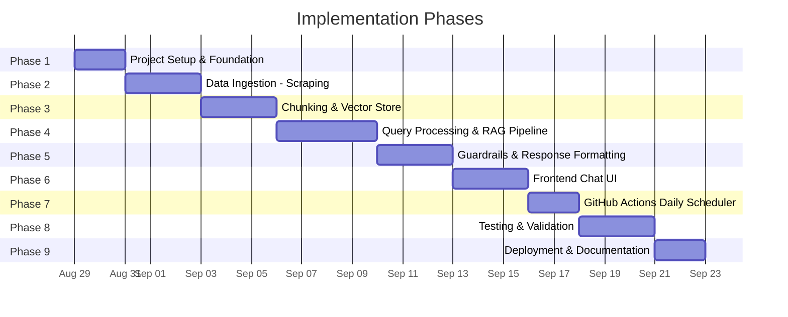
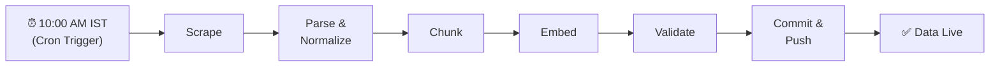
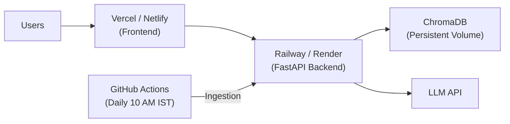
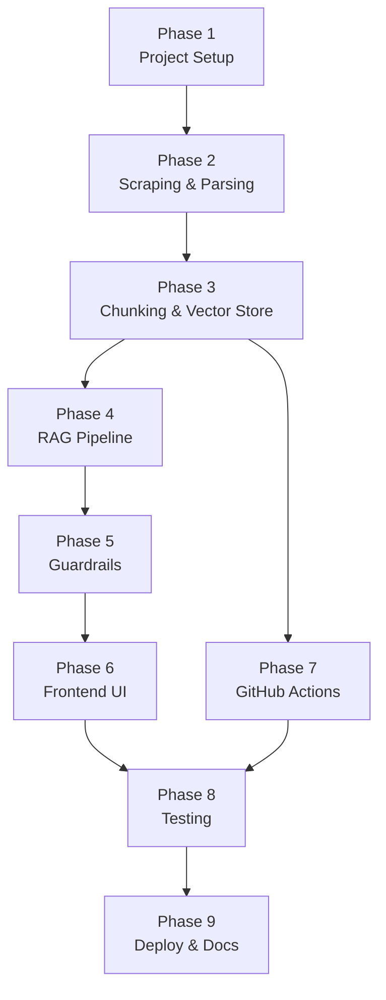

# Implementation Plan: Mutual Fund FAQ Assistant

> **Project**: Facts-Only Mutual Fund FAQ Assistant (RAG-based)
> **AMC Scope**: Navi Mutual Fund — All Equity Schemes
> **Reference**: [problemStatement.md](file:///c:/Mutual%20fund%20chatbot%20nextleap/problemStatement.md) · [Architecture.md](file:///c:/Mutual%20fund%20chatbot%20nextleap/Architecture.md)

---

## Phase Overview



| Phase | Name | Duration | Key Deliverable |
|---|---|---|---|
| **1** | Project Setup & Foundation | 2 days | Repo structure, dependencies, config |
| **2** | Data Ingestion — Scraping & Parsing | 3 days | Raw + normalized fund data from Navi MF |
| **3** | Chunking & Vector Store | 3 days | Embedded chunks in ChromaDB |
| **4** | Query Processing & RAG Pipeline | 4 days | End-to-end retrieval + LLM generation |
| **5** | Guardrails & Response Formatting | 3 days | Refusal handler, privacy guard, formatter |
| **6** | Frontend Chat UI | 3 days | Minimal chat interface with disclaimer |
| **7** | GitHub Actions Daily Scheduler | 2 days | Automated daily ingestion pipeline |
| **8** | Testing & Validation | 3 days | Unit + integration + E2E tests |
| **9** | Deployment & Documentation | 2 days | Live deployment + README |
| | **Total Estimated Duration** | **~25 days** | |

---

## Phase 1: Project Setup & Foundation

**Goal**: Establish the repository structure, install all dependencies, and configure the development environment.

**Duration**: 2 days

### Tasks

- [x] Initialize Git repository
- [x] Create project directory structure (as defined in [Architecture.md § 4.2](file:///c:/Mutual%20fund%20chatbot%20nextleap/Architecture.md))
- [x] Create and populate `requirements.txt`
- [x] Create `.env.example` with all required environment variables
- [x] Create `config.py` for centralized configuration
- [x] Set up `.gitignore` (exclude `.env`, `__pycache__`, `vectorstore/chroma_db/`)
- [x] Initialize FastAPI app skeleton (`backend/main.py`)
- [x] Verify local development server runs (`uvicorn backend.main:app --reload`)

### Directory Structure to Create

```
mutual-fund-chatbot/
├── .github/workflows/
├── data/
│   ├── raw/
│   └── processed/
├── ingestion/
├── vectorstore/
├── backend/
│   ├── routes/
│   ├── services/
│   └── prompts/
├── frontend/
├── tests/
├── requirements.txt
├── .env.example
└── .gitignore
```

### Dependencies (`requirements.txt`)

```
# Web framework
fastapi>=0.100.0
uvicorn>=0.23.0

# Scraping
beautifulsoup4>=4.12.0
requests>=2.31.0
selenium>=4.15.0

# Document processing
PyPDF2>=3.0.0

# LangChain & RAG
langchain>=0.2.0
langchain-community>=0.2.0
langchain-openai>=0.1.0

# Embeddings & Vector store
sentence-transformers>=2.2.0
chromadb>=0.4.0

# Cross-encoder re-ranking
cross-encoder>=0.0.1

# LLM providers
openai>=1.0.0
google-generativeai>=0.5.0

# Utilities
python-dotenv>=1.0.0
pydantic>=2.0.0
```

### Environment Variables (`.env.example`)

```env
# LLM Configuration
LLM_PROVIDER=openai              # openai | google | ollama
OPENAI_API_KEY=sk-xxx
GOOGLE_API_KEY=xxx
OLLAMA_BASE_URL=http://localhost:11434

# Embedding Model
EMBEDDING_MODEL=sentence-transformers/all-MiniLM-L6-v2

# Vector Store
CHROMA_PERSIST_DIR=./vectorstore/chroma_db

# Scraping
SCRAPE_SOURCE_URL=https://www.indmoney.com/mutual-funds/amc/navi-mutual-fund

# App
APP_HOST=0.0.0.0
APP_PORT=8000
```

### Exit Criteria

- [x] `uvicorn` starts without errors
- [x] `GET /api/health` returns `{"status": "ok"}`
- [x] All dependencies install cleanly

---

## Phase 2: Data Ingestion — Scraping & Parsing

**Goal**: Scrape all Navi Mutual Fund equity scheme pages, extract structured fund data, and store as normalized JSON.

**Duration**: 3 days

### Tasks

- [x] **Day 1**: Build the web scraper (`ingestion/scraper.py`)
  - [x] Scrape the Navi MF AMC listing page to get all equity fund URLs
  - [x] For each fund, scrape the individual fund page
  - [x] Save raw HTML to `data/raw/` with timestamped filenames
  - [x] Handle rate limiting, retries, and error logging

- [x] **Day 2**: Build the document parser (`ingestion/parser.py`)
  - [x] Parse raw HTML into structured JSON records
  - [x] Extract key fields per fund:

| Field | Example |
|---|---|
| `fund_name` | Navi Large Cap Equity Fund |
| `fund_category` | Large Cap |
| `expense_ratio` | 0.12% |
| `exit_load` | 1% if redeemed within 1 year |
| `min_sip_amount` | ₹500 |
| `min_lumpsum` | ₹5,000 |
| `benchmark_index` | Nifty 50 TRI |
| `riskometer` | Very High |
| `lock_in_period` | None / 3 years (ELSS) |
| `source_url` | https://www.indmoney.com/... |
| `scrape_date` | 2026-08-29 |

  - [x] Save normalized data to `data/processed/funds.json`

- [x] **Day 3**: Build metadata & citations stores
  - [x] Generate `data/fund_metadata.json` (fund name → category mapping)
  - [x] Generate `data/citations_index.json` (chunk → source URL + date)
  - [x] Add content hashing for change detection
  - [x] Write validation script to verify extracted data completeness

### Key Files

| File | Purpose |
|---|---|
| `ingestion/scraper.py` | Fetches raw HTML from source URLs |
| `ingestion/parser.py` | Parses HTML → structured JSON |
| `data/raw/*.html` | Raw scraped pages |
| `data/processed/funds.json` | Normalized fund records |
| `data/fund_metadata.json` | Fund name ↔ category mapping |
| `data/citations_index.json` | Source URL + scrape date per chunk |

### Exit Criteria

- [ ] All Navi MF equity fund pages scraped successfully
- [ ] `funds.json` contains complete records for every fund
- [ ] Every record has all required fields populated
- [ ] Content hashes generated for change detection

---

## Phase 3: Chunking & Vector Store

**Goal**: Split normalized fund data into semantic chunks, generate embeddings, and store in ChromaDB.

**Duration**: 3 days

### Tasks

- [x] **Day 1**: Build the text chunker (`ingestion/chunker.py`)
  - [x] **Strategy**: Document-per-Fund (Record-level stringification). Do not split blindly using `RecursiveCharacterTextSplitter` since the data is highly structured JSON.
  - [x] Convert each fund's JSON record into a single human-readable text block (e.g., "Fund Name: X. Category: Y. Expense Ratio: Z...").
  - [x] Each fund becomes exactly one chunk. This preserves complete context per fund (approx. 50-100 tokens), preventing fragmented metrics.
  - [x] Attach all exact fields as metadata to the chunk for potential metadata filtering:
    ```json
    {
      "chunk_id": "navi_aggressive_hybrid_fund_direct_growth_full",
      "fund_name": "Navi Aggressive Hybrid Fund Direct Growth",
      "fund_category": "Aggressive Allocation",
      "scheme_code": "4087",
      "source_url": "https://...",
      "scrape_date": "2026-08-28"
    }
    ```
    - [ ] Verify chunk count matches expected range
    - [ ] Verify embedding dimensions (384 for MiniLM)
    - [ ] Detect zero/null vectors
    - [ ] Test similarity search with sample queries
  - [ ] Run end-to-end: `scraper → parser → chunker → embedder → ChromaDB`
  - [ ] Verify retrieval with 5 sample queries

### Sample Validation Queries

| Query | Expected Top Result |
|---|---|
| "expense ratio of Navi Large Cap Fund" | Chunk containing expense ratio data |
| "minimum SIP amount" | Chunk with SIP details |
| "exit load Navi ELSS" | Chunk with ELSS exit load info |
| "riskometer classification" | Chunk with risk category |
| "benchmark index" | Chunk with benchmark details |

### Exit Criteria

- [ ] All chunks stored in ChromaDB with correct metadata
- [ ] Similarity search returns relevant results for all 5 test queries
- [ ] `validate.py` passes all sanity checks
- [ ] Full pipeline runs end-to-end without errors

---

## Phase 4: Query Processing & RAG Pipeline

**Goal**: Build the core backend pipeline — intent classification, category disambiguation, retrieval with re-ranking, and LLM response generation.

**Duration**: 4 days

### Tasks

- [ ] **Day 1**: Intent Classifier (`backend/services/intent_classifier.py`)
  - [ ] Implement hybrid classification (regex first pass + LLM fallback)
  - [ ] Four intent types:

  | Intent | Action |
  |---|---|
  | `FACTUAL` | Proceed to retrieval |
  | `ADVISORY` | Trigger refusal |
  | `AMBIGUOUS_CATEGORY` | Trigger disambiguation |
  | `PII_DETECTED` | Trigger privacy guard |

  - [ ] Build regex patterns for advisory queries
  - [ ] Build regex patterns for PII detection
  - [ ] LLM-based fallback for edge cases
  - [ ] Unit tests for all intent types

- [ ] **Day 2**: Category Disambiguator (`backend/services/disambiguator.py`)
  - [ ] Load `fund_metadata.json` at startup
  - [ ] Build category keyword matcher (large cap, small cap, mid cap, ELSS, flexi cap, etc.)
  - [ ] Support aliases and informal names (e.g., "largecap" → "Large Cap")
  - [ ] Return list of matching funds when category is detected but no specific fund named
  - [ ] Handle user's fund selection in follow-up message

  ```
  User: "What's the expense ratio of a large cap fund?"
  Bot:  "I found these Large Cap funds from Navi MF:
         1. Navi Large Cap Equity Fund
         Which one would you like info on?"
  User: "1"
  Bot:  "The expense ratio of Navi Large Cap Equity Fund is..."
  ```

- [ ] **Day 3**: Retrieval Engine (`backend/services/retriever.py`)
  - [ ] **Strategy**: Metadata-Driven Retrieval. Since the dataset is strictly one chunk per fund (17 total chunks), pure semantic search risks cross-fund contamination (returning metrics for the wrong fund). The best strategy is to use the fund identified during disambiguation as a strict metadata filter.
  - [ ] Connect to ChromaDB vector store
  - [ ] Execute `similarity_search` applying strict metadata filters (e.g., `filter={"fund_name": target_fund}`)
  - [ ] Top-K = 2 (Since each fund is a single chunk, K=2 is more than enough when filtered)
  - [ ] Drop Cross-Encoder re-ranking (Unnecessary latency and overhead for a metadata-filtered, 17-chunk dataset)
  - [ ] Test retrieval accuracy with 10+ sample queries

- [ ] **Day 4**: Response Generator (`backend/services/generator.py`)
  - [ ] Create system prompt template (`backend/prompts/system_prompt.txt`)
  - [ ] Integrate with LLM provider (OpenAI / Gemini / Ollama)
  - [ ] Pass retrieved chunks as context to LLM
  - [ ] Enforce response constraints:
    - Max 3 sentences
    - Exactly 1 citation link
    - Footer: `"Last updated from sources: <date>"`
  - [ ] Handle "no relevant context found" gracefully
  - [ ] Wire up the full pipeline: query → classify → disambiguate → retrieve → generate

### Exit Criteria

- [ ] Intent classifier correctly routes 95%+ of test queries
- [ ] Disambiguation correctly lists funds for category-level queries
- [ ] Retrieval returns relevant chunks for all test queries
- [ ] LLM generates compliant, 3-sentence responses with citation + footer
- [ ] Full pipeline works end-to-end via manual testing

---

## Phase 5: Guardrails & Response Formatting

**Goal**: Implement refusal handling, privacy guard, and strict response formatting to ensure compliance with all constraints.

**Duration**: 3 days

### Tasks

    "Compare Fund A vs Fund B"
    "Will this fund give good returns?"
    ```
  - [ ] Generate polite refusal response with:
    - Facts-only limitation message
    - Educational link (AMFI / SEBI)
    - Standard footer
  - [ ] Create refusal prompt template (`backend/prompts/refusal_prompt.txt`)

- [ ] **Day 2**: Privacy Guard (`backend/services/privacy_guard.py`)
  - [ ] Implement PII detection regex patterns:

  | PII Type | Pattern |
  |---|---|
  | PAN | `[A-Z]{5}\d{4}[A-Z]` |
  | Aadhaar | `\d{4}\s?\d{4}\s?\d{4}` |
  | Account numbers | `\d{9,18}` |
  | OTP | `\d{4,6}` with OTP context |
  | Email | Standard email regex |
  | Phone | Indian mobile number pattern |

  - [ ] Block PII queries **before** they reach the LLM
  - [ ] Return privacy warning without logging the query content
  - [ ] Unit tests for all PII patterns

- [ ] **Day 3**: Response Formatter (`backend/services/formatter.py`)
  - [ ] Validate LLM output against constraints:
    - Sentence count ≤ 3
    - Exactly 1 citation link present
    - Footer with `"Last updated from sources: <date>"`
  - [ ] Auto-truncate responses exceeding 3 sentences
  - [ ] Auto-append footer if missing
  - [ ] Build unified response envelope:
    ```json
    {
      "type": "answer | disambiguation | refusal | privacy_warning",
      "message": "...",
      "citation": "https://...",
      "footer": "Last updated from sources: 2026-08-29",
      "session_id": "uuid"
    }
    ```

### Exit Criteria

- [ ] All advisory queries trigger polite refusal with educational link
- [ ] All PII-containing queries are blocked before reaching the LLM
- [ ] Every response conforms to the 3-sentence + 1 citation + footer format
- [ ] Formatter handles edge cases (missing citation, long response, etc.)

---

## Phase 6: Frontend Chat UI

**Goal**: Build a minimal, clean chat interface with welcome message, example questions, and facts-only disclaimer.

**Duration**: 3 days

### Tasks

- [x] **Day 1**: Scaffold Vite + React Application (`frontend/`)
  - [x] Create project structure and integrate Tailwind CSS
  - [x] Translate `stitch` UI mockups into reusable React components
  - [x] Build `Layout`, `Header`, `Sidebar`, and `WelcomeScreen` components

- [x] **Day 2**: Chat Feed & Styling (`frontend/src/components/`)
  - [x] Build `ChatFeed.jsx` and `MessageBubble.jsx`
  - [x] Apply Tailwind utility classes for dark/light themes and spacing
  - [x] Build `ChatInput.jsx` with input field and submit buttons

- [x] **Day 3**: Chat logic (`frontend/src/hooks/useChat.js`)
  - [x] Connect to `POST /api/chat` endpoint using `fetch`
  - [x] Send user messages and display bot responses
  - [x] Handle response types: `answer`, `disambiguation`, `refusal`, `privacy_warning`
  - [x] Build frontend to `dist/` and serve via FastAPI `StaticFiles`

  - [ ] Session management (generate `session_id`)
  - [ ] Loading/typing indicator while waiting for response
  - [ ] Auto-scroll to latest message
  - [ ] Handle network errors gracefully

### Wireframe

```
┌─────────────────────────────────────────────┐
│  🏦 Navi Mutual Fund FAQ Assistant          │
│  ─────────────────────────────────────────  │
│  ⚠️ Facts-only. No investment advice.       │
├─────────────────────────────────────────────┤
│                                             │
│  👋 Welcome! I can answer factual questions │
│  about Navi Mutual Fund schemes.            │
│                                             │
│  Try asking:                                │
│  ┌─────────────────────────────────────┐    │
│  │ What is the expense ratio of Navi   │    │
│  │ Large Cap Equity Fund?              │    │
│  └─────────────────────────────────────┘    │
│  ┌─────────────────────────────────────┐    │
│  │ What is the exit load for Navi      │    │
│  │ ELSS Tax Saver Fund?               │    │
│  └─────────────────────────────────────┘    │
│  ┌─────────────────────────────────────┐    │
│  │ What is the minimum SIP amount for  │    │
│  │ Navi Midcap 150 Index Fund?         │    │
│  └─────────────────────────────────────┘    │
│                                             │
│           ┌─────────────┐  ┌──────┐         │
│           │ Type here...│  │ Send │         │
│           └─────────────┘  └──────┘         │
└─────────────────────────────────────────────┘
```

### Exit Criteria

- [ ] Chat UI renders correctly on desktop and mobile
- [ ] Example questions are clickable and trigger API calls
- [ ] All 4 response types render correctly
- [ ] Disambiguation shows clickable fund selection buttons
- [ ] Typing indicator shows during API calls
- [ ] Disclaimer is always visible

---

## Phase 7: GitHub Actions Daily Scheduler

**Goal**: Automate the full ingestion pipeline (scrape → parse → chunk → embed → update DB) to run daily at **10:00 AM IST (04:30 UTC)** via GitHub Actions.

**Duration**: 2 days

### Tasks

- [ ] **Day 1**: Create workflow file
  - [ ] Create `.github/workflows/daily-ingestion.yml`
  - [ ] Configure cron schedule: `'30 4 * * *'` (10:00 AM IST)
  - [ ] Add `workflow_dispatch` for manual triggers
  - [ ] Steps:
    1. Checkout repository
    2. Setup Python 3.11 with pip cache
    3. Install dependencies
    4. Run `ingestion/scraper.py`
    5. Run `ingestion/parser.py`
    6. Run `ingestion/chunker.py`
    7. Run `ingestion/embedder.py`
    8. Run `ingestion/validate.py`
    9. Commit & push updated data files
  - [ ] Configure GitHub repository variables:
    - `SCRAPE_SOURCE_URL`
    - `EMBEDDING_MODEL`
  - [ ] Add failure notification (auto-create GitHub Issue)

- [ ] **Day 2**: Content hashing & incremental updates
  - [ ] Implement content hashing in `scraper.py`
    - Compute SHA-256 hash of each scraped page
    - Compare with stored hashes from previous run
    - Only re-process pages with changed content
  - [ ] Implement incremental vector store updates in `embedder.py`
    - Upsert changed/new chunks
    - Delete stale chunks for removed content
  - [ ] Test the full pipeline locally before pushing
  - [ ] Trigger manual workflow run via GitHub UI
  - [ ] Verify auto-commit of updated data

### Workflow Summary



### Exit Criteria

- [ ] Workflow triggers successfully on cron schedule
- [ ] Manual trigger via `workflow_dispatch` works
- [ ] Content hashing correctly skips unchanged pages
- [ ] Updated data is auto-committed to the repository
- [ ] Failure notifications create GitHub Issues automatically

---

## Phase 8: Testing & Validation

**Goal**: Comprehensive testing across all components — unit tests, integration tests, and end-to-end validation.

**Duration**: 3 days

### Tasks

- [ ] **Day 1**: Unit Tests
  - [ ] `tests/test_intent_classifier.py`
    - [ ] Test FACTUAL intent detection (10+ cases)
    - [ ] Test ADVISORY intent detection (10+ cases)
    - [ ] Test PII_DETECTED intent (all PII types)
    - [ ] Test AMBIGUOUS_CATEGORY intent (category keywords)
    - [ ] Test edge cases (mixed intent, borderline queries)

  - [ ] `tests/test_privacy_guard.py`
    - [ ] Test PAN detection
    - [ ] Test Aadhaar detection
    - [ ] Test email detection
    - [ ] Test phone number detection
    - [ ] Test OTP detection
    - [ ] Test clean queries pass through

  - [ ] `tests/test_refusal_handler.py`
    - [ ] Test advisory query refusal
    - [ ] Test refusal includes educational link
    - [ ] Test refusal includes footer

- [ ] **Day 2**: Integration Tests
  - [ ] `tests/test_retriever.py`
    - [ ] Test vector search returns relevant chunks
    - [ ] Test metadata filtering by fund name
    - [ ] Test metadata filtering by category
    - [ ] Test re-ranking improves result quality
    - [ ] Test top-3 selection from top-5 candidates

  - [ ] `tests/test_formatter.py`
    - [ ] Test response ≤ 3 sentences
    - [ ] Test citation link present
    - [ ] Test footer appended
    - [ ] Test truncation of long responses

  - [ ] `tests/test_disambiguator.py`
    - [ ] Test category detection for all categories
    - [ ] Test alias handling ("largecap" → "Large Cap")
    - [ ] Test fund list returned correctly

- [ ] **Day 3**: End-to-End Tests
  - [ ] `tests/test_e2e.py`
    - [ ] Full pipeline: factual query → correct answer with citation
    - [ ] Full pipeline: advisory query → polite refusal
    - [ ] Full pipeline: PII query → privacy block
    - [ ] Full pipeline: category query → disambiguation → selection → answer
    - [ ] Full pipeline: unknown query → graceful "I don't know"

### Test Query Matrix

| # | Query | Expected Intent | Expected Behavior |
|---|---|---|---|
| 1 | "Expense ratio of Navi Large Cap Fund" | FACTUAL | Return expense ratio + citation |
| 2 | "What is the exit load for Navi ELSS?" | FACTUAL | Return exit load details |
| 3 | "Minimum SIP amount" | AMBIGUOUS_CATEGORY | Ask which fund |
| 4 | "Should I invest in Navi Large Cap?" | ADVISORY | Polite refusal + AMFI link |
| 5 | "Which fund is better?" | ADVISORY | Polite refusal |
| 6 | "My PAN is ABCDE1234F" | PII_DETECTED | Privacy warning |
| 7 | "1 yr returns of large cap fund" | AMBIGUOUS_CATEGORY | List large cap funds |
| 8 | "Benchmark index of Navi ELSS Tax Saver" | FACTUAL | Return benchmark + citation |
| 9 | "Compare Navi Large Cap vs Small Cap" | ADVISORY | Polite refusal |
| 10 | "How to download capital gains report?" | FACTUAL | Return process + citation |

### Exit Criteria

- [ ] All unit tests pass (≥95% coverage on services)
- [ ] All integration tests pass
- [ ] All 10 E2E test scenarios pass
- [ ] No PII leaks in any code path
- [ ] All responses comply with formatting constraints

---

## Phase 9: Deployment & Documentation

**Goal**: Deploy the application to production and create comprehensive documentation.

**Duration**: 2 days

### Tasks

- [ ] **Day 1**: Deployment
  - [ ] Deploy backend to Railway / Render / GCP Cloud Run
    - [ ] Set environment variables on hosting platform
    - [ ] Configure persistent volume for ChromaDB
    - [ ] Verify API endpoints are accessible
  - [ ] Deploy frontend to Vercel / Netlify
    - [ ] Update API base URL in `app.js`
    - [ ] Verify frontend → backend connectivity
  - [ ] Verify GitHub Actions workflow runs against production
  - [ ] Set up basic monitoring (health check endpoint)
  - [ ] Test full flow on production

- [ ] **Day 2**: Documentation (`README.md`)
  - [ ] Project overview and objective
  - [ ] Selected AMC and schemes list
  - [ ] Architecture overview with diagrams
  - [ ] Setup instructions (local development)
    ```bash
    # Clone
    git clone <repo-url>
    cd mutual-fund-chatbot

    # Install dependencies
    pip install -r requirements.txt

    # Configure
    cp .env.example .env
    # Edit .env with your API keys

    # Run ingestion pipeline
    python ingestion/scraper.py
    python ingestion/parser.py
    python ingestion/chunker.py
    python ingestion/embedder.py

    # Start backend
    uvicorn backend.main:app --reload

    # Open frontend
    # Open frontend/index.html in browser
    ```
  - [ ] Environment variables reference
  - [ ] API documentation
  - [ ] Known limitations
  - [ ] Disclaimer: _"Facts-only. No investment advice."_

### Deployment Architecture



### Exit Criteria

- [ ] Application accessible via public URL
- [ ] All API endpoints respond correctly in production
- [ ] GitHub Actions daily pipeline runs successfully
- [ ] README.md is complete with setup instructions
- [ ] Disclaimer is visible on the deployed UI

---

## Risk Register

| Risk | Probability | Impact | Mitigation |
|---|---|---|---|
| Source website structure changes | Medium | High | Use resilient CSS selectors; add scraper health checks |
| LLM hallucination | Medium | High | Strict system prompt; source validation layer |
| Rate limiting on source sites | Low | Medium | Respectful scraping intervals; caching |
| GitHub Actions free tier limits | Low | Low | Pipeline runs ~5 min; well within limits |
| Embedding model size on CI | Low | Medium | Use lightweight MiniLM-L6; cache pip dependencies |
| API key exposure | Medium | Critical | Use GitHub Secrets; never commit `.env` |

---

## Dependencies Between Phases



> [!TIP]
> **Phase 6 (Frontend)** and **Phase 7 (GitHub Actions)** can be developed **in parallel** since they have no mutual dependencies — both depend on Phase 3/5 being complete.

---

## Definition of Done (Project-Level)

- [ ] All Navi MF equity fund data scraped, chunked, and embedded
- [ ] RAG pipeline answers factual queries accurately with citations
- [ ] Advisory/PII queries are correctly refused/blocked
- [ ] Category disambiguation works for all fund categories
- [ ] Every response: ≤ 3 sentences + 1 citation + footer
- [ ] Chat UI is live with welcome message, examples, and disclaimer
- [ ] Daily ingestion runs at 10:00 AM IST via GitHub Actions
- [ ] All tests pass
- [ ] README.md and documentation complete
- [ ] Deployed to production with public URL
